# Analisi Completa del Progetto Smart Home

## 1. Obiettivo del Progetto

Realizzare un sistema Smart Home con interfaccia centralizzata che consenta di:

- gestire stanze, dispositivi e automazioni
- controllare lo stato operativo della casa
- registrare e consultare gli eventi di sistema
- eseguire backup e analisi statistiche.

---

## 2. Attori e Permessi

### Attori principali

- **Utente**
- **Amministratore**
- **Tempo**

### Regole di accesso

- L'**Utente** gestisce: stanze (CRUD), dispositivi (CRUD + comandi), automazioni (CRUD), monitoraggio/statistiche.
- L'**Amministratore** può fare tutto ciò che fa l'Utente e in più può consultare/esportare lo storico eventi.
- Il trigger temporale è usato per scenari automatici (es. esecuzione automazioni, backup automatico nei diagrammi dedicati).

### Diagramma attori

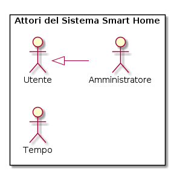

---

## 3. Casi d'Uso

### 3.1 Elenco casi d'uso principali

| ID | Caso d'Uso | Attori coinvolti |
|---|---|---|
| UC1 | Accesso e dashboard | Utente, Amministratore |
| UC2 | Gestione stanze (CRUD) | Utente, Amministratore |
| UC3 | Gestione dispositivi (CRUD) | Utente, Amministratore |
| UC4 | Controllo dispositivi | Utente, Amministratore |
| UC5 | Gestione automazioni (CRUD) | Utente, Amministratore |
| UC6 | Consultazione storico eventi | Amministratore |
| UC7 | Gestione backup | Amministratore |
| UC8 | Monitoraggio e statistiche | Utente, Amministratore |

### 3.2 Vista per Utente

Contiene solo i casi d'uso operativi dell'Utente.

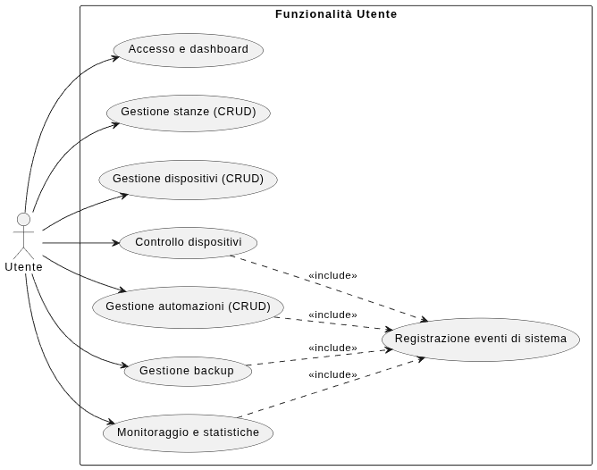

### 3.3 Vista per Amministratore

Contiene i casi d'uso dell'Amministratore, inclusa la consultazione storico eventi.

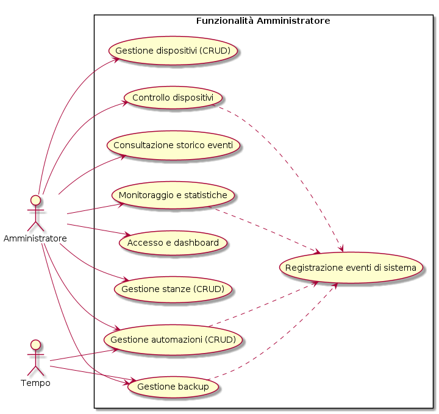

### 3.4 Vista sistema e monitoraggio

Focalizzata su backup/monitoraggio e registrazione eventi.

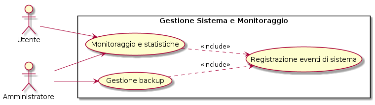

---

## 4. Requisiti Funzionali

### 4.1 Requisiti principali

- **Gestione casa**: visualizzazione e CRUD stanze, associazione dispositivi.
- **Gestione dispositivi**: visualizzazione, controllo comandi, aggiornamento stato, rilevamento offline.
- **Gestione automazioni**: inserimento, modifica, attivazione/disattivazione, valutazione/esecuzione.
- **Gestione storico**: consultazione, filtro, esportazione eventi.
- **Gestione sistema**: statistiche, backup, notifiche/eventi.

### 4.2 Diagramma requisiti

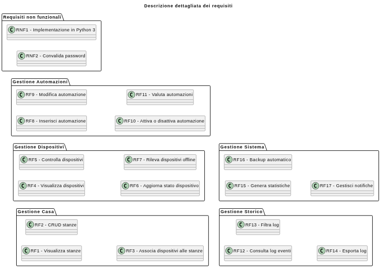

### 4.3 Matrice di mapping

| Requisito | UC1 | UC2 | UC3 | UC4 | UC5 | UC6 | UC7 | UC8 |
|---|---|---|---|---|---|---|---|---|
| RF1 - Visualizza stanze | X | X |  |  |  |  |  |  |
| RF2 - CRUD stanze |  | X |  |  |  |  |  |  |
| RF3 - Associa dispositivi alle stanze |  | X | X |  |  |  |  |  |
| RF4 - Visualizza dispositivi | X |  | X |  |  |  |  | X |
| RF5 - Controlla dispositivi |  |  |  | X |  |  |  |  |
| RF6 - Aggiorna stato dispositivo |  |  | X | X |  |  |  |  |
| RF7 - Rileva dispositivi offline |  |  | X |  |  |  |  | X |
| RF8 - Inserisci automazione |  |  |  |  | X |  |  |  |
| RF9 - Modifica automazione |  |  |  |  | X |  |  |  |
| RF10 - Attiva/disattiva automazione |  |  |  |  | X |  |  |  |
| RF11 - Valuta automazioni |  |  |  |  | X |  |  | X |
| RF12 - Consulta log eventi |  |  |  |  |  | X |  |  |
| RF13 - Filtra log |  |  |  |  |  | X |  |  |
| RF14 - Esporta log |  |  |  |  |  | X |  |  |
| RF15 - Genera statistiche |  |  |  |  |  |  |  | X |
| RF16 - Backup automatico |  |  |  |  |  |  | X |  |
| RF17 - Gestisci notifiche/eventi | X |  |  |  |  | X |  | X |

---

## 5. Architettura Logica

Il sistema segue una struttura a strati:

- **Presentazione** (Viste)
- **Applicazione** (Controllori)
- **Servizi** (Logica di business)
- **Persistenza** (Repository JSON)

### 5.1 Diagramma classi applicative

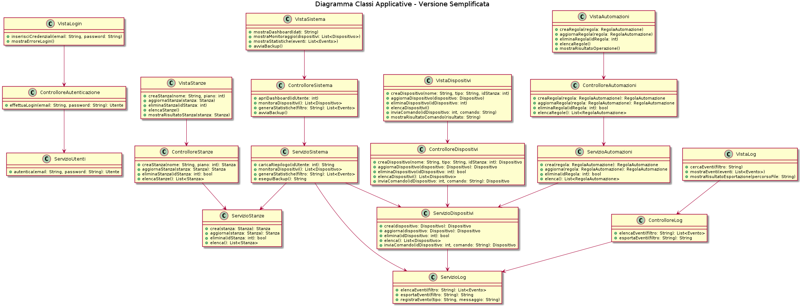

### 5.2 Diagramma classi di dominio

Definisce le entità principali del modello Smart Home.

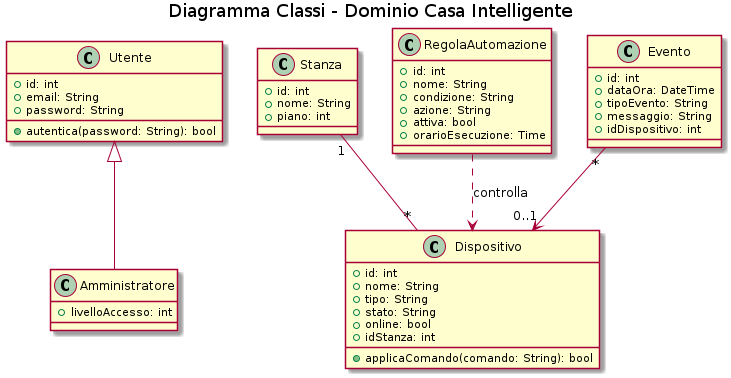

### 5.3 Diagramma classi repository

Mostra interfacce repository e implementazioni JSON.

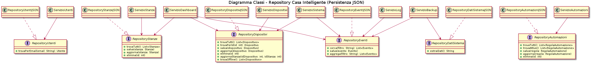

---

## 6. Diagrammi di Sequenza

I diagrammi di sequenza descrivono i flussi principali end-to-end.

### 6.1 Accesso e dashboard

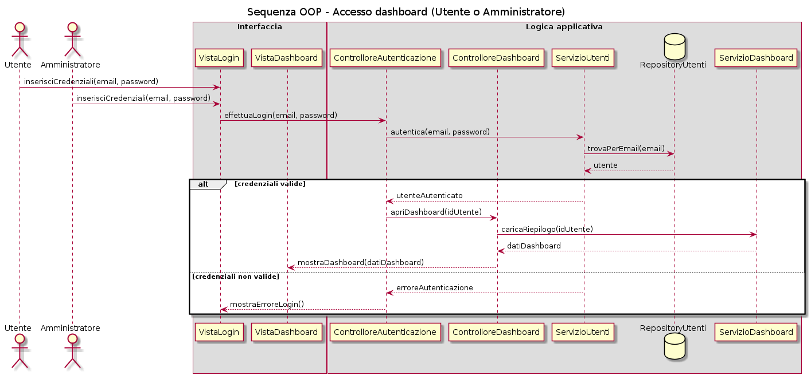

### 6.2 Gestione stanze e dispositivi

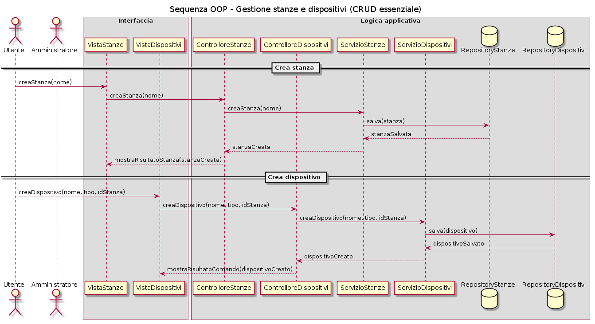

### 6.3 Controllo dispositivo

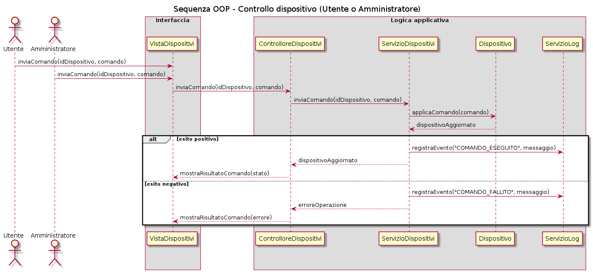

### 6.4 Gestione automazioni

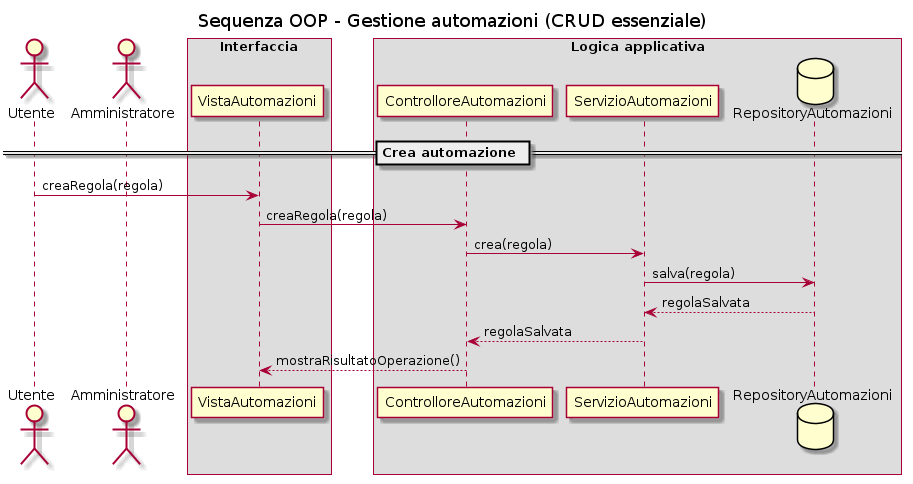

### 6.5 Esecuzione automazioni

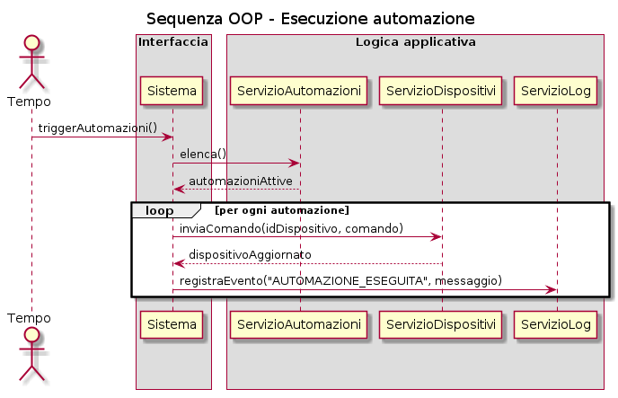

### 6.6 Consultazione storico eventi (solo Amministratore)

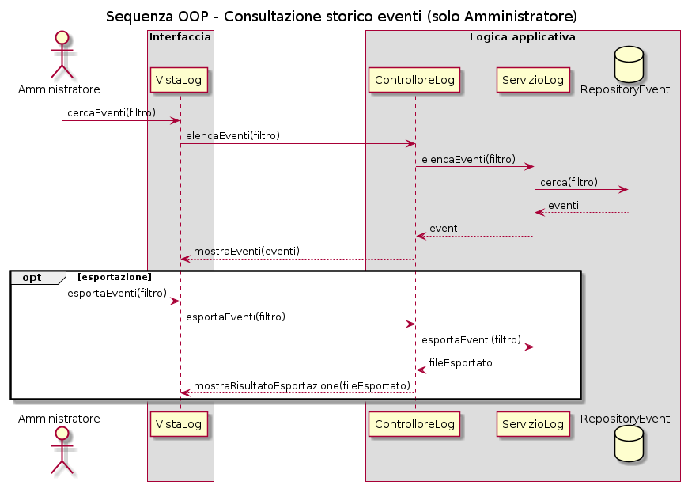

### 6.7 Backup automatico

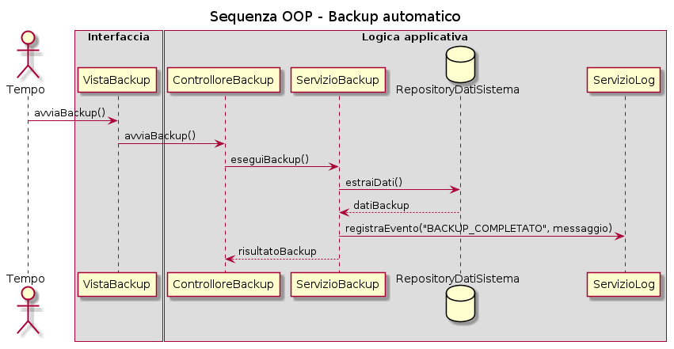

### 6.8 Monitoraggio e statistiche

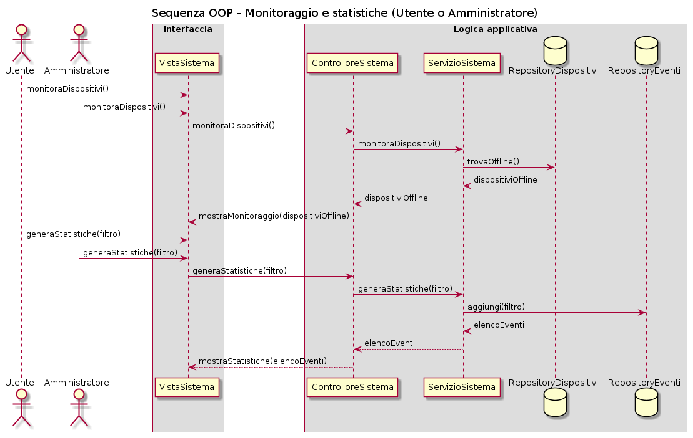

---

## 7. Diagrammi di Attività

I diagrammi di attività evidenziano il flusso operativo delle funzionalità.

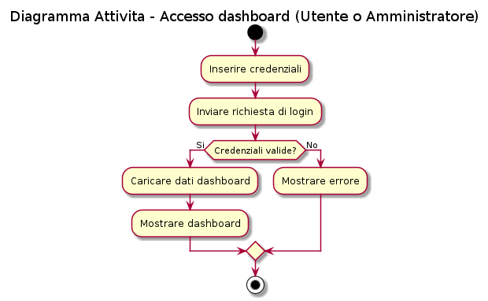

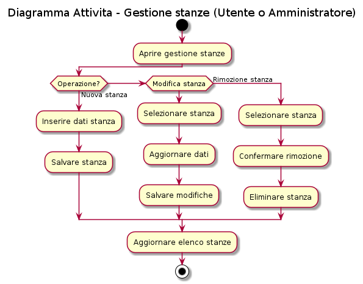

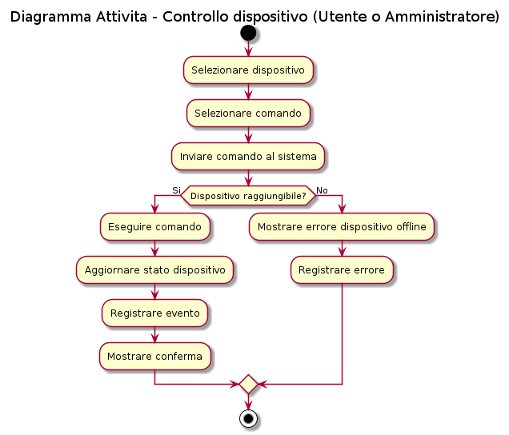

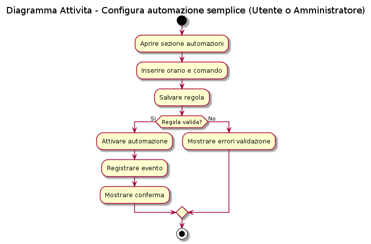

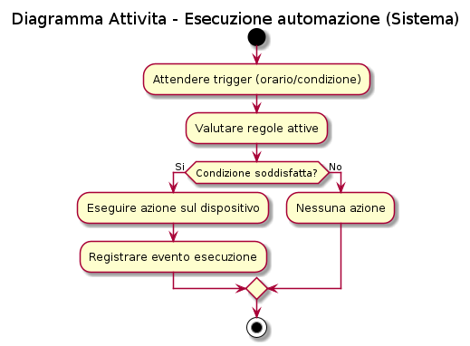

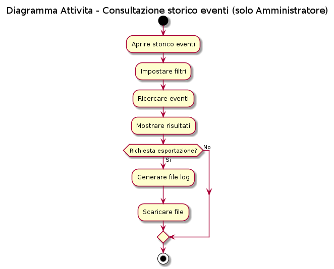

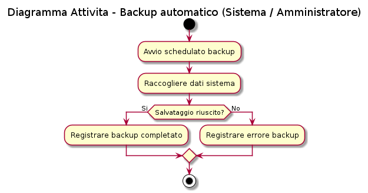

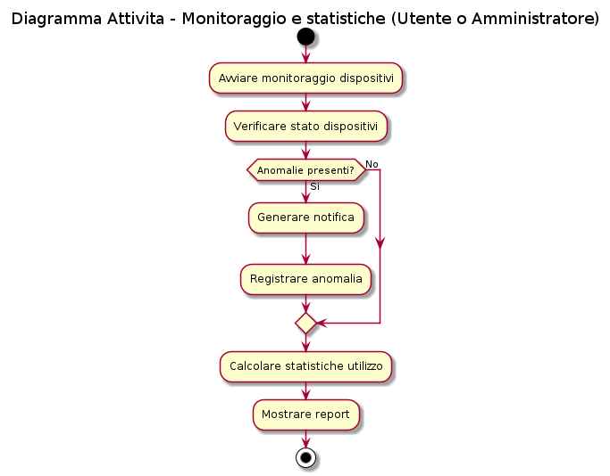

---

## 8. Package di Analisi

Vista modulare complessiva e per sottoinsiemi funzionali.

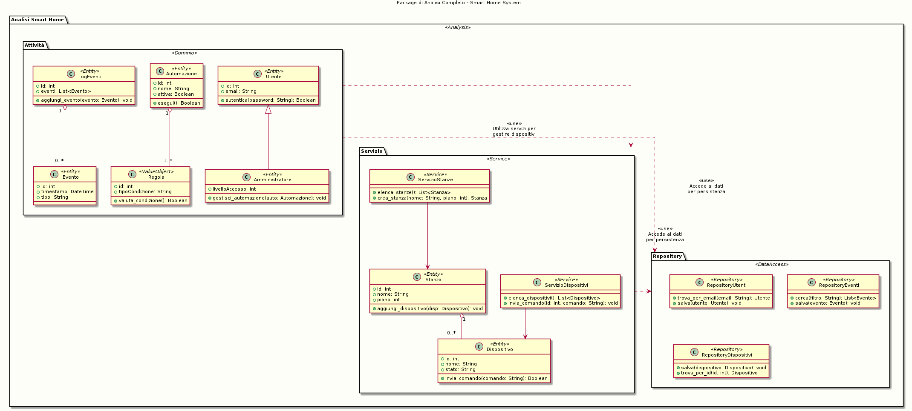
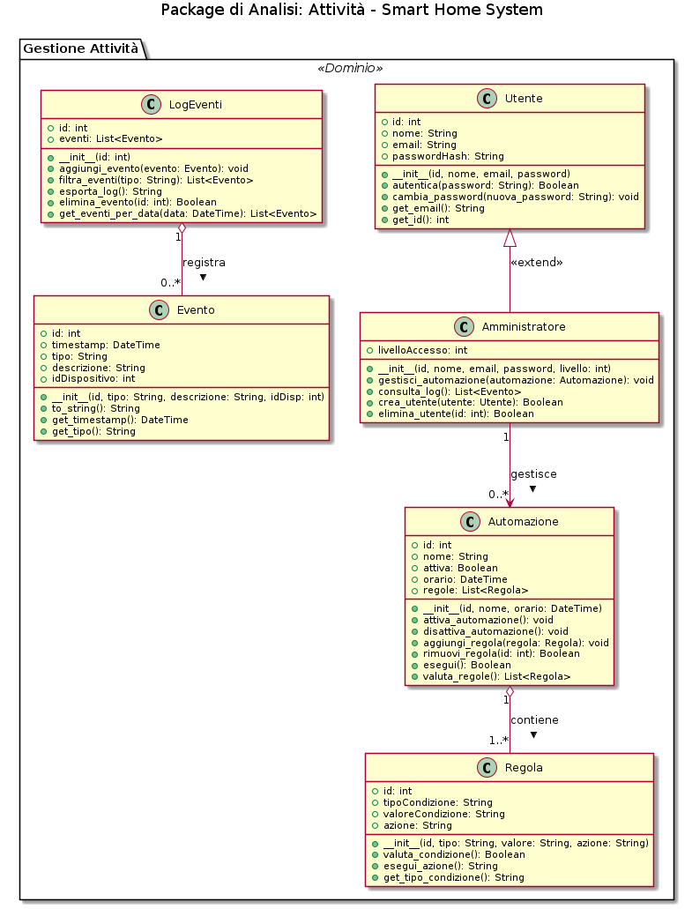
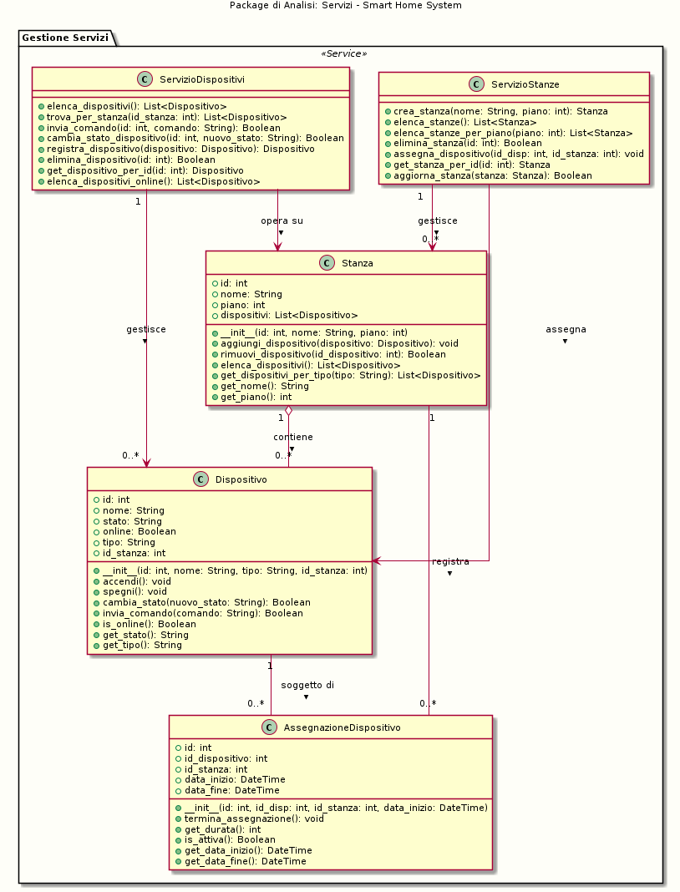